# Python MH6802 Fintech Ecosystem & Innovation
This project is about making an ecommerce web that has all the ecommerce features

1. User: User Sign Up & Login; User Profile; User Carts
2. Product: Product Search; Product Review & Ratings
3. Checkout Process: Shipping, Payment Feature
4. Payment API: Paypal API
5. Customer Experience: Chat Feature, Product recommender at HomeScreen.js (ProductCarousel.js)
6. Database Management System: Django Admin panel

Things to implement: 
1. Machine Learning Product Recommender using user's buying habit
2. Live streaming feature for customer interaction

### Getting Started with Create React App

This project was bootstrapped with [Create React App](https://github.com/facebook/create-react-app).

### `npm start`

Runs the app in the development mode.\
Open [http://localhost:3000](http://localhost:3000) to view it in the browser.

The page will reload if you make edits.\
You will also see any lint errors in the console.

### Purpose of this project
This project was built for class MH6802 FinTech Ecosystem at Nanyang Technological University with Lecturer Dr.Song Jin. 

### Cadabra E-commerce UI/UX
This is the UI/UX of the ecommerce
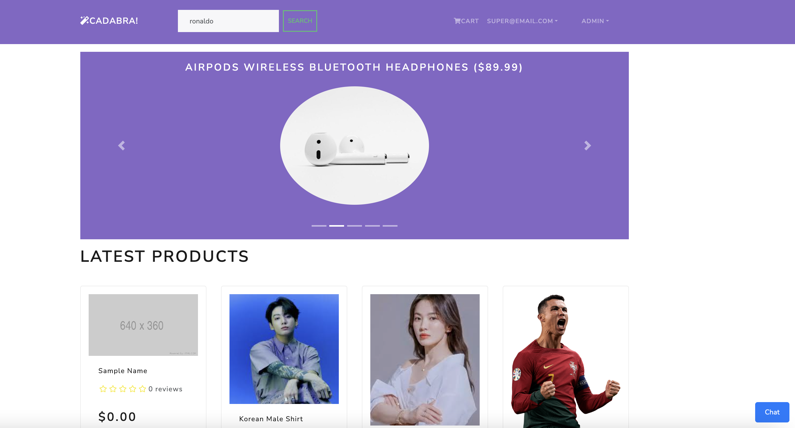
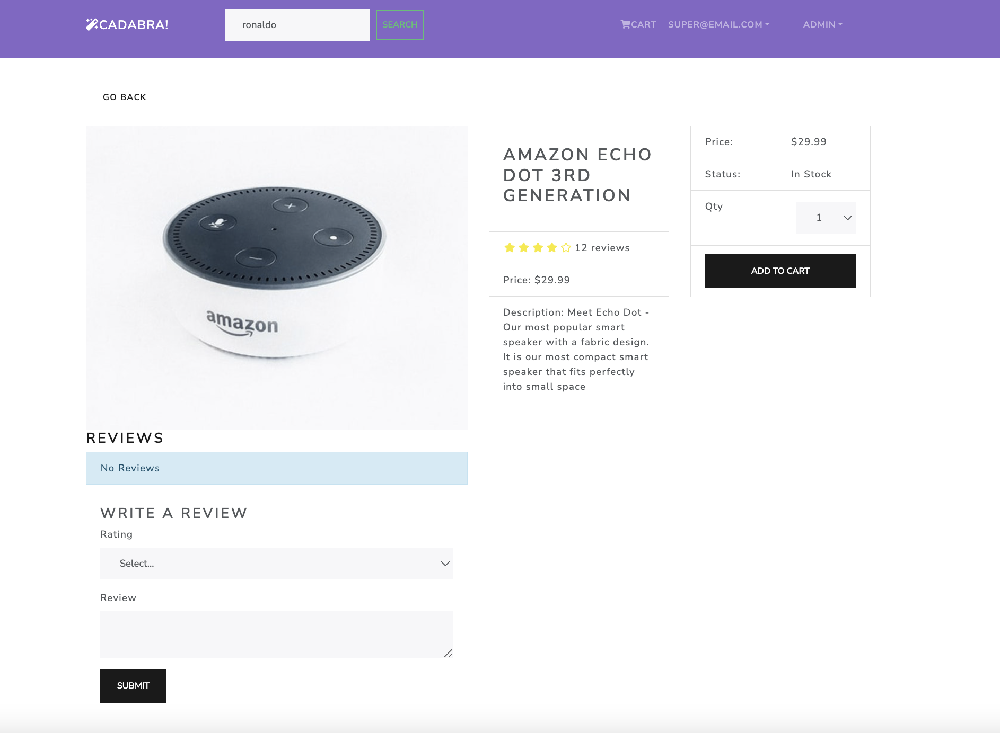
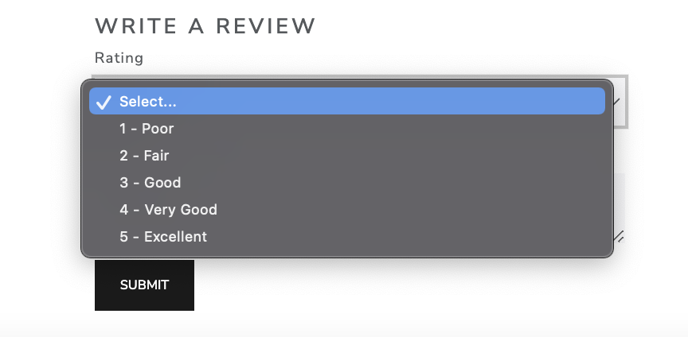
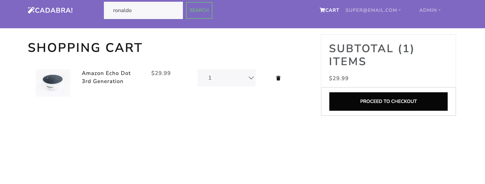
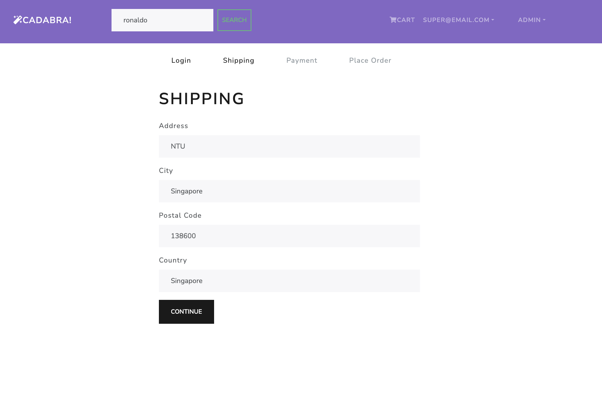
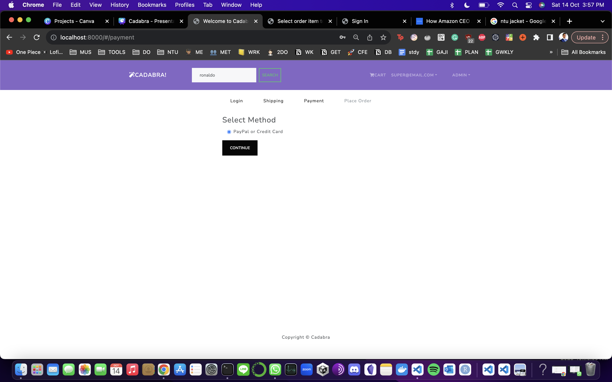
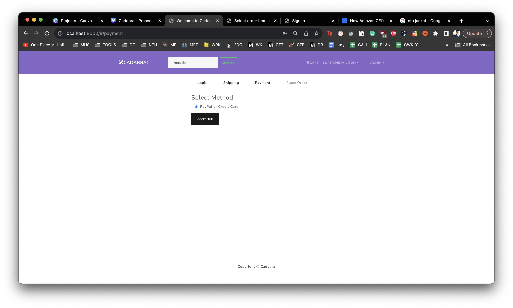
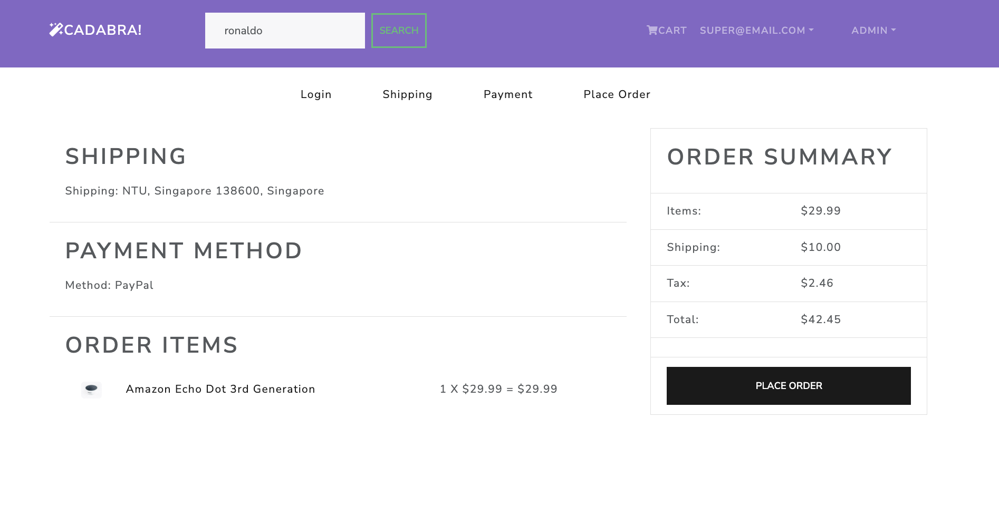
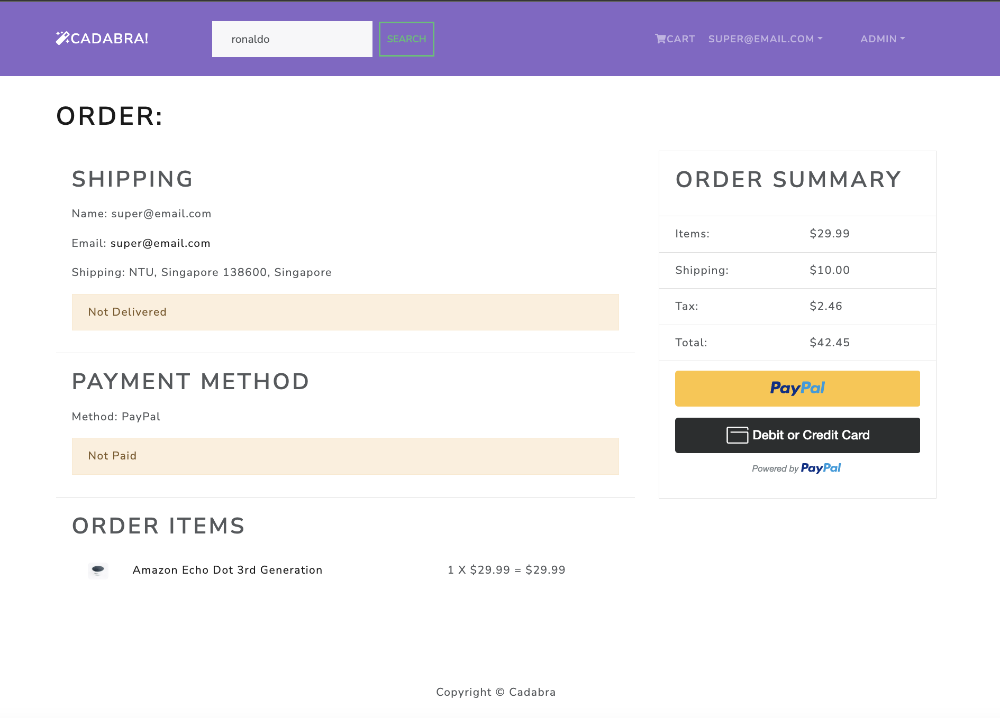
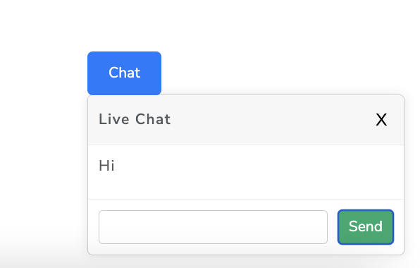
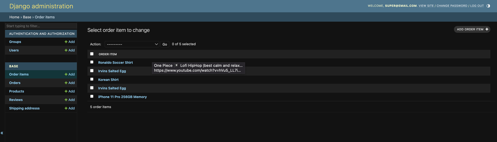
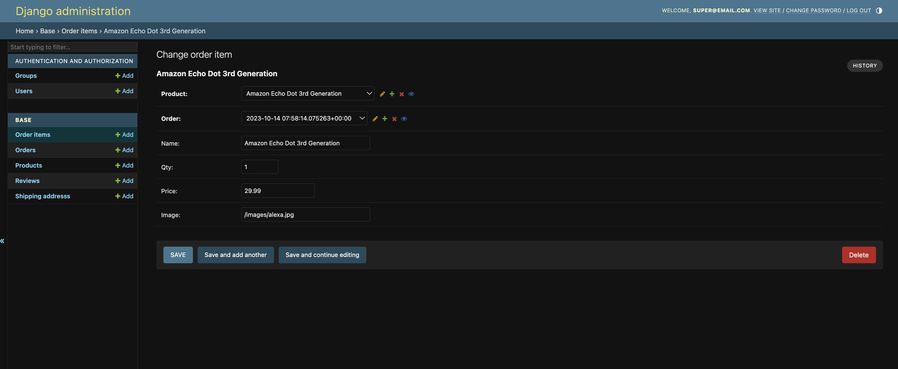
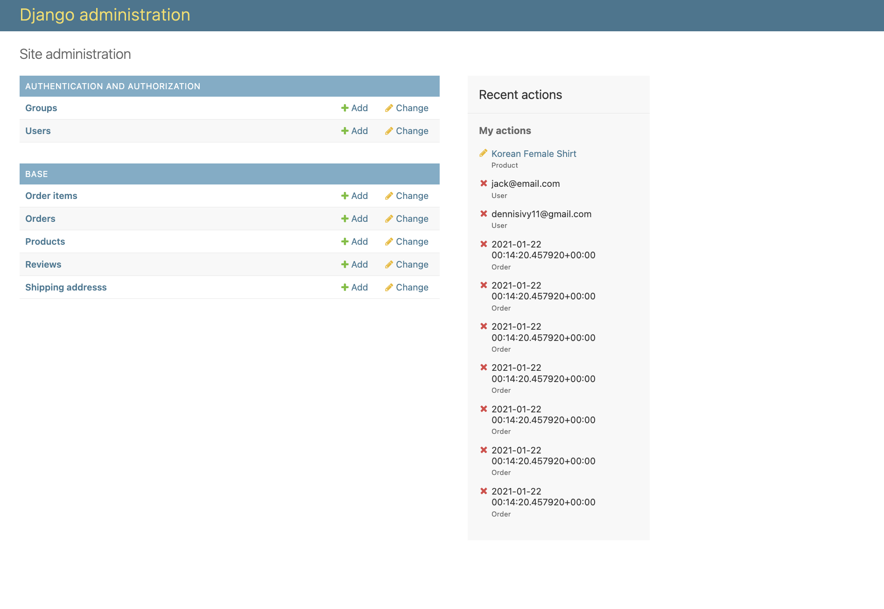
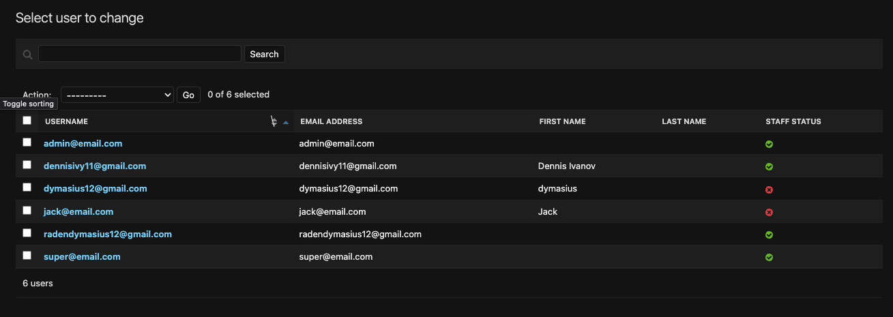

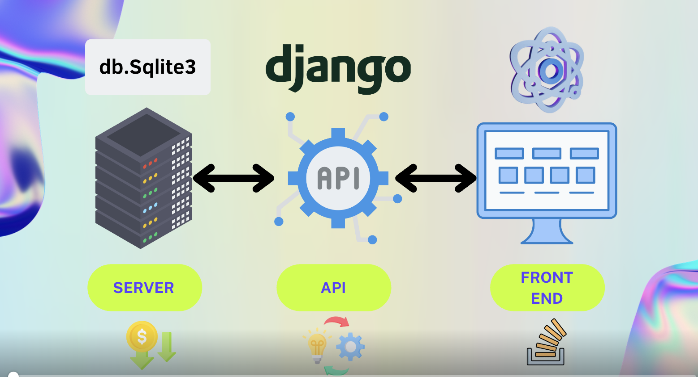