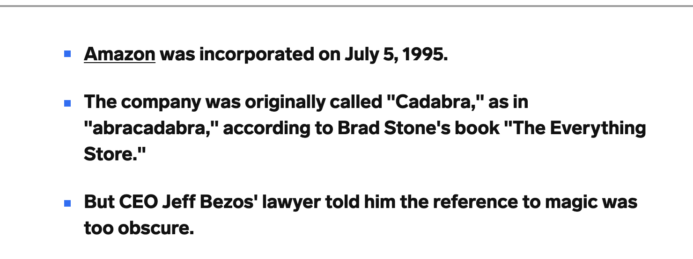

# Python MH6802 Fintech Ecosystem & Innovation
This project is about making an ecommerce web that has all the ecommerce features
1. Login
2. Registration
3. Cart
4. Shipping
5. Product display

Things to implement: 
1. Backend for user data storage
2. Payment linked with backend
3. User display linked with backend

### Ecommerce UI/UX
This is the UI/UX of the ecommerce

### Getting Started with Create React App

This project was bootstrapped with [Create React App](https://github.com/facebook/create-react-app).

### `npm start`

Runs the app in the development mode.\
Open [http://localhost:3000](http://localhost:3000) to view it in the browser.

The page will reload if you make edits.\
You will also see any lint errors in the console.